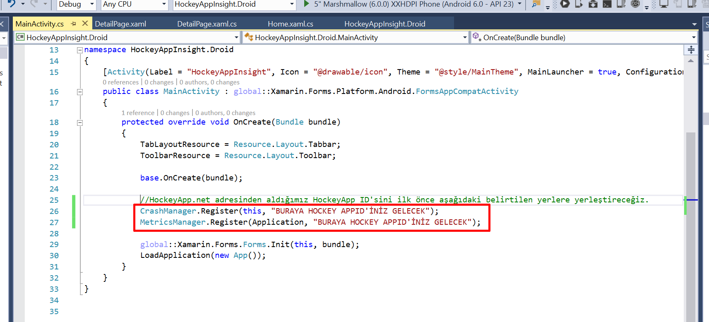
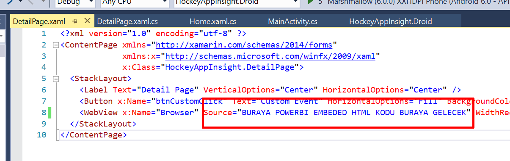
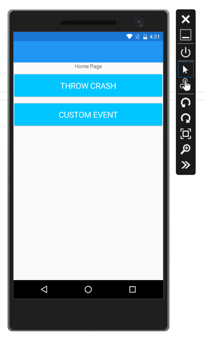

# Mobile DevOps için Xamarin Uygulama Örneği
Bu bölümde Mobile DevOps örneğimizi test edebilmek için, kod tarafında hata oluşturduğumuz ve bu hatayı HockeyApp aracılığı ile raporladığımız bir kod örneğini gerçekleştireceğiz.

## Gereksinimler
- [Visual Studio 2015 ve üzeri](http://www.visualstudio.com)
- [Xamarin Kurulumu Yapılması](http://www.xamarin.com)

## HockeyAppSDK'sı Tanımlanmış Xamarin Uygulamasını HockeyApp'e bağlama
Örnek hataları ve custom kodları test edebileceğimiz xamarin uygulamasında HockeyApp'in SDKsı hem Xamarin.Forms'un Portable Class Library Projesinde hem de  Android projesinde tanımlı durumda. Sadece bu uygulamaya HockeyApp'teki oluşturacağımız uygulama ID'sini ekleyeceğiz.

1. Aldığımız HockeyApp ID'sini ilk önce Xamarin Android projesi altındaki "MainActivity.cs" kodunda aşağıdaki belirtilen yerlere yerleştireceğiz.
    	

```cs
//HockeyApp.net adresinden aldığımız HockeyApp ID'sini ilk önce aşağıdaki belirtilen yerlere yerleştireceğiz.
    CrashManager.Register(this, "BURAYA HOCKEY APPID'İNİZ GELECEK");
    MetricsManager.Register(Application, "BURAYA HOCKEY APPID'İNİZ GELECEK");
```

1. Daha sonra Portable Class Library Projesi altındaki 'DetailPage.cs' altındaki webview'i isterseniz PowerBI Embeded projenizdeki raporunuzu yerleştirebilirsiniz 

    	

1. Şimdi projenizi derleyerek Xamarin Android Projesinin çalışacak ana proje olduğundan emin olarak, F5'e basarak projenizi çalıştırın ve aşağıdaki ekranı aldığınızdan emin olun. 
		

1. Daha sonra 'custom event' butonuna tıklayarak custom event oluşturup, geri dönerek, 'Custom Crash'leri oluşturmak için 'Throw Crash' butonuna tıklayın. Daha sonra uygulama hata vererek kapacaktır. Uygulamayı tekrar emulatör içerisinden açarak aynı işlemleri tekrarlayın ve HockeyApp.net adresinde projenizin altında bu custom logları ve eventleri görünceye kadar devam edin.

## Ek Kaynaklar
- [Visual Studio](http://www.visualstudio.com)
- [Xamarin](http://www.xamarin.com)
- [HockeyApp](http://hockeyapp.net)
