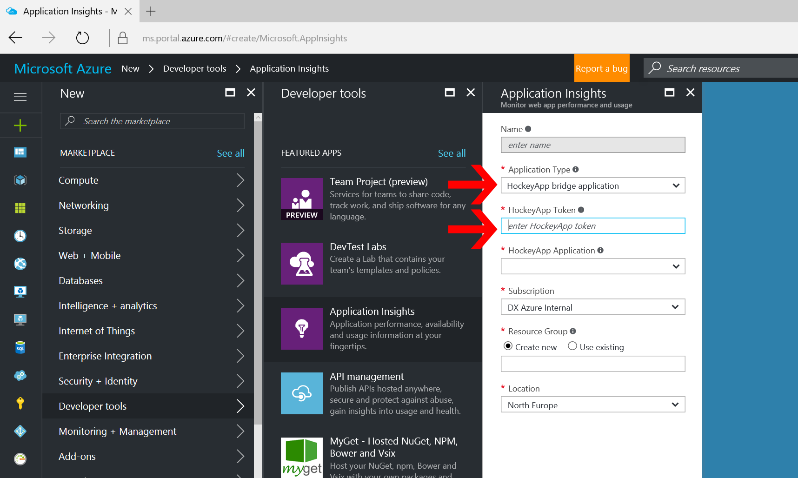
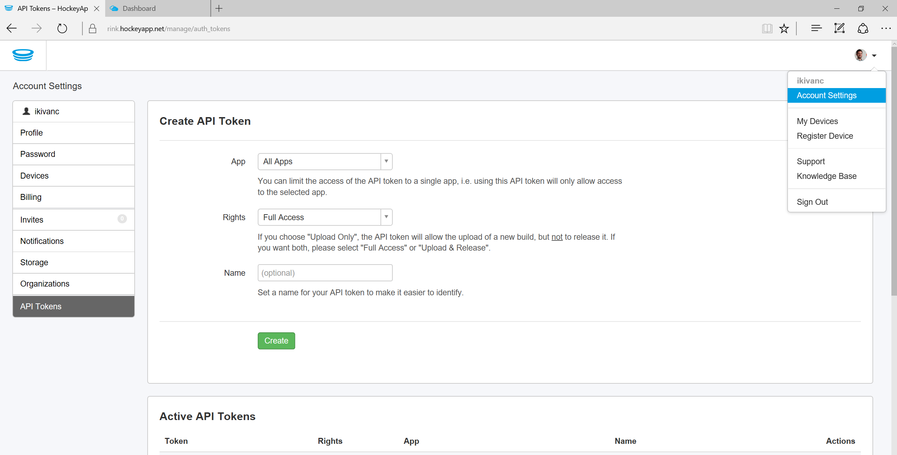
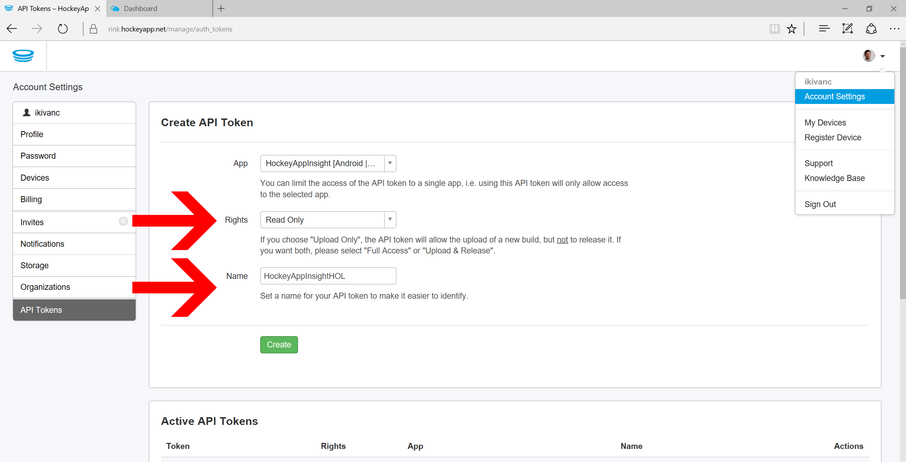
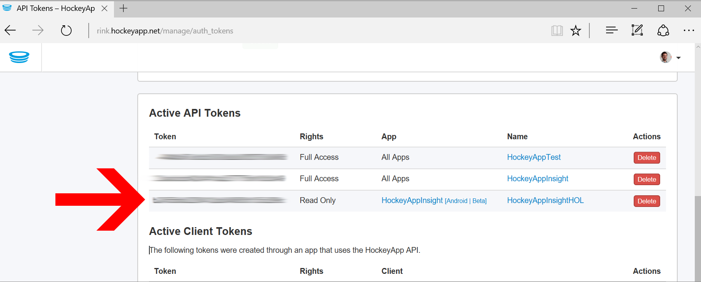
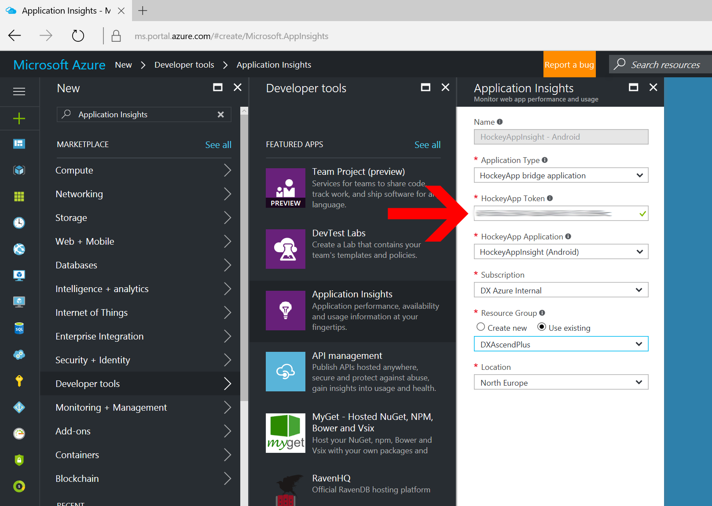
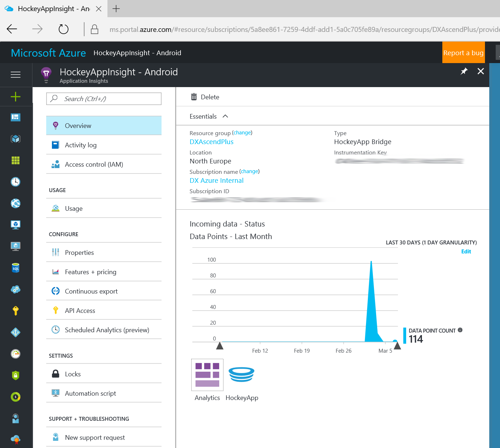
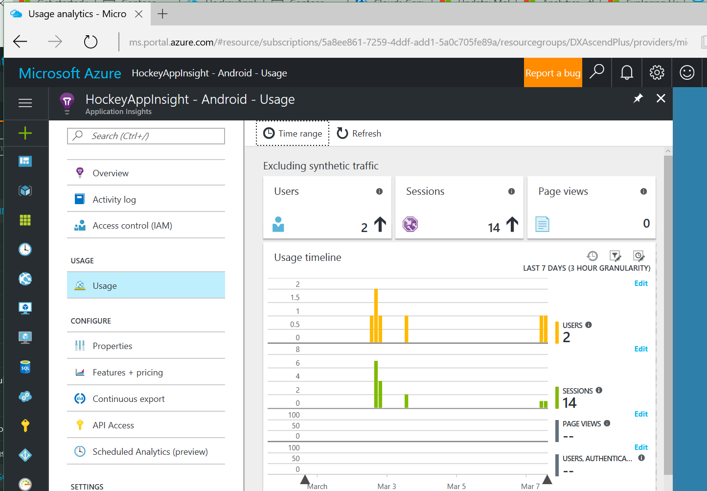
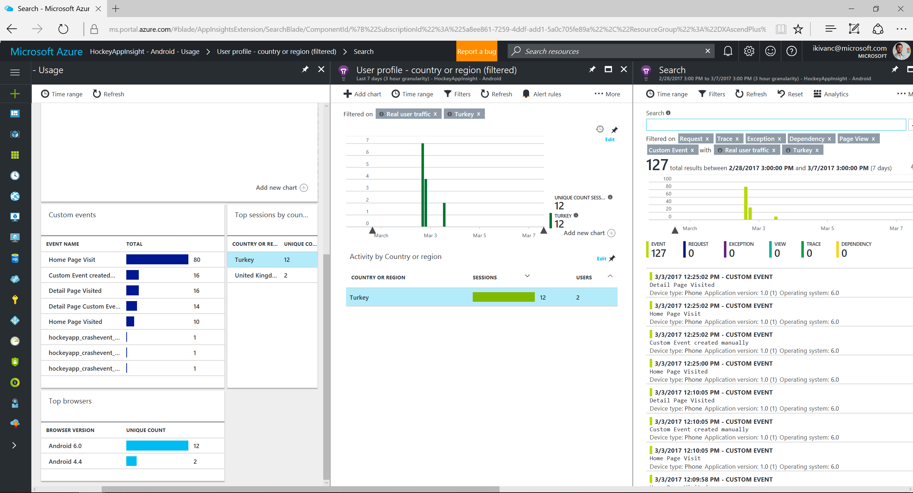

# Application Insight Bridge
Application insight son pozisyonlaması ile birlikte server-side uygulamaların takibinde kullanılırken, mobil uygulama kullanıcı hatalarını tespit etmek ve kullanıcı davranışlarını inceleyebilmek için HockeyApp'i kullanabiliyoruz. Özellikle de bu iki servisin tüm özelliklerinden faydalanabilmek için biribiri ile bağlayarak daha fazla analitik bilgiler edinmek mümkün.

## Application Insight ve Hockey App'i Birleştirme
Bu dökümanda 2 servisin adım adım nasıl entegre edilebileceğini görebileceğiz.

Application Insight ve HockeyApp'in yapabildiklerinin karşılaştırmaları ve nerede hangi aracı kullanmamız gerektiğini aşağıdaki tablodan edinebilirsiniz.

| Veri Tipi |Application Insights SDK 'sı tarafından desteklenenler|HockeySDK tarafından desteklenenler|
|--------|:-------|:-----------|
| Traces | Evet tüm platformlar | Sadece Windows platformları | 
| Custom events with custom dimensions |  Evet tüm platformlar| Evet tüm platformlar|| Page views | Evet tüm platformlar | Sadece Windows platformu | 
| Dependencies | Sadece Windows platformu | Sadece Windows platformu |
|Metrics |Evet tüm platformlar | Sadece Windows platformu |
|Exceptions | Evet, Custom Eventler aracılığı ile |Evet, Custom Eventler aracılığı ile 
|

HockeyApp ve Application Insight'ın birlikte kullanımı için, adım adım eklemeleri gerçekleştirelim.

1. Azure portal üzerinden login olarak yeni bir Application Insight projesi oluşturalım.
    

1. Burada "Application Type" olarak HockeyApp bridge application seçerek HockeyApp'ten aldığımı token'i buraya girelim.
    

1. HockeyApp'ten token'i alabilmek için "Account Settings" ten "API Token" I seçelim.
    

1. Burada yetki vermek istediğiniz uygulamayı seçerek ilgili hakları vererek isimlendirebiliriz.
    
    
1. Daha sonra aşağıdaki gibi uygulamamıza erişim token'ı verecektir.
    

1. Bu token'I Application Insight'ta kullanarak uygulamamımızın adınını otomatik olarak seçildiğini görebileceğiz. 
    

1. Sonra "Pin to dashboard"u seçerek oluşturduktan sonra aşağıdaki şekilde entegrasyonunun oluştuğunu görebileceğiz.
    

1. Oluşturulan projede uygulamamız çalıştıkça overview ve usage kısmından yansımalarını takip edebiliriz.
    

1. Rapordaki detaylara tıklayarak da raporun kırılımlarını görebilirsiniz. 
    

## Ek Kaynaklar
- [Feed Power BI from Application Insights](https://docs.microsoft.com/en-us/azure/application-insights/app-insights-export-power-bi)
- [Interactive Analytics with Application Insights](https://channel9.msdn.com/events/Build/2016/T666)
- [Exploring HockeyApp data in Application Insights](https://docs.microsoft.com/en-us/azure/application-insights/app-insights-hockeyapp-bridge-app)
- [Update: Mobile and Desktop app telemetry experience in Application Insights and HockeyApp](https://azure.microsoft.com/en-us/blog/mobile-and-desktop-telemetry-in-application-insight-and-hockeyapp/)
- [How to use HockeyApp with Visual Studio Team Services (VSTS) or Team Foundation Server (TFS)](https://support.hockeyapp.net/kb/third-party-bug-trackers-services-and-webhooks/how-to-use-hockeyapp-with-visual-studio-team-services-vsts-or-team-foundation-server-tfs)