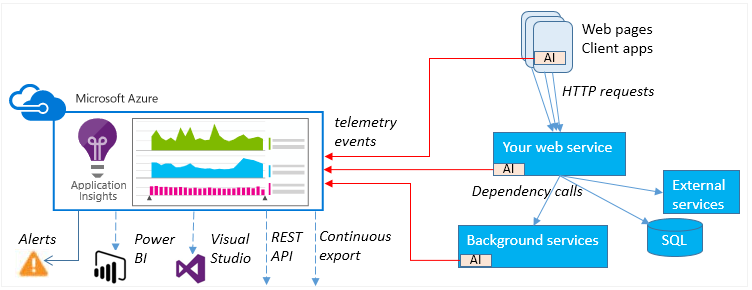
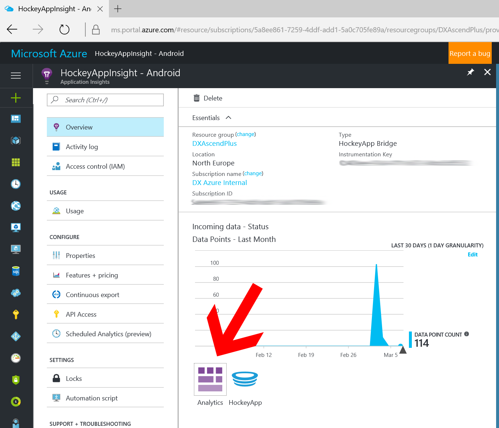
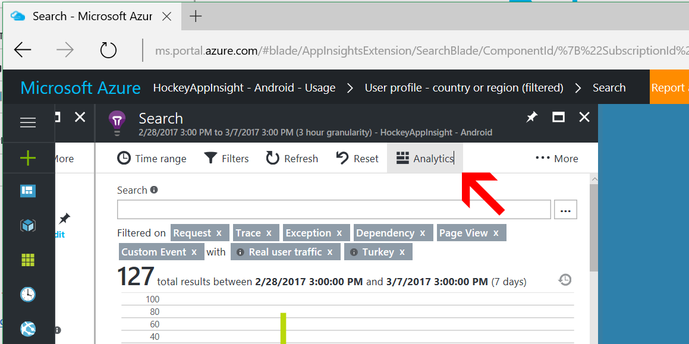
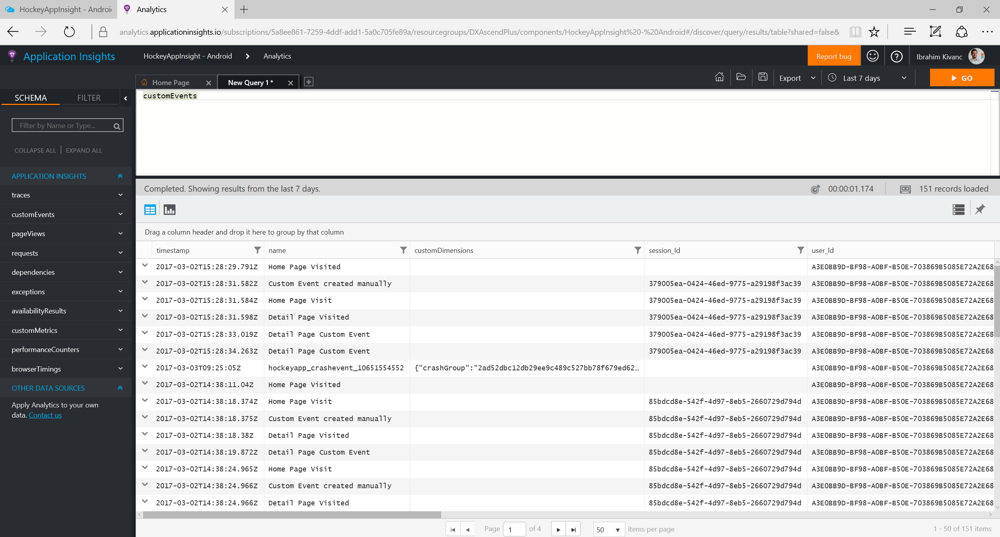
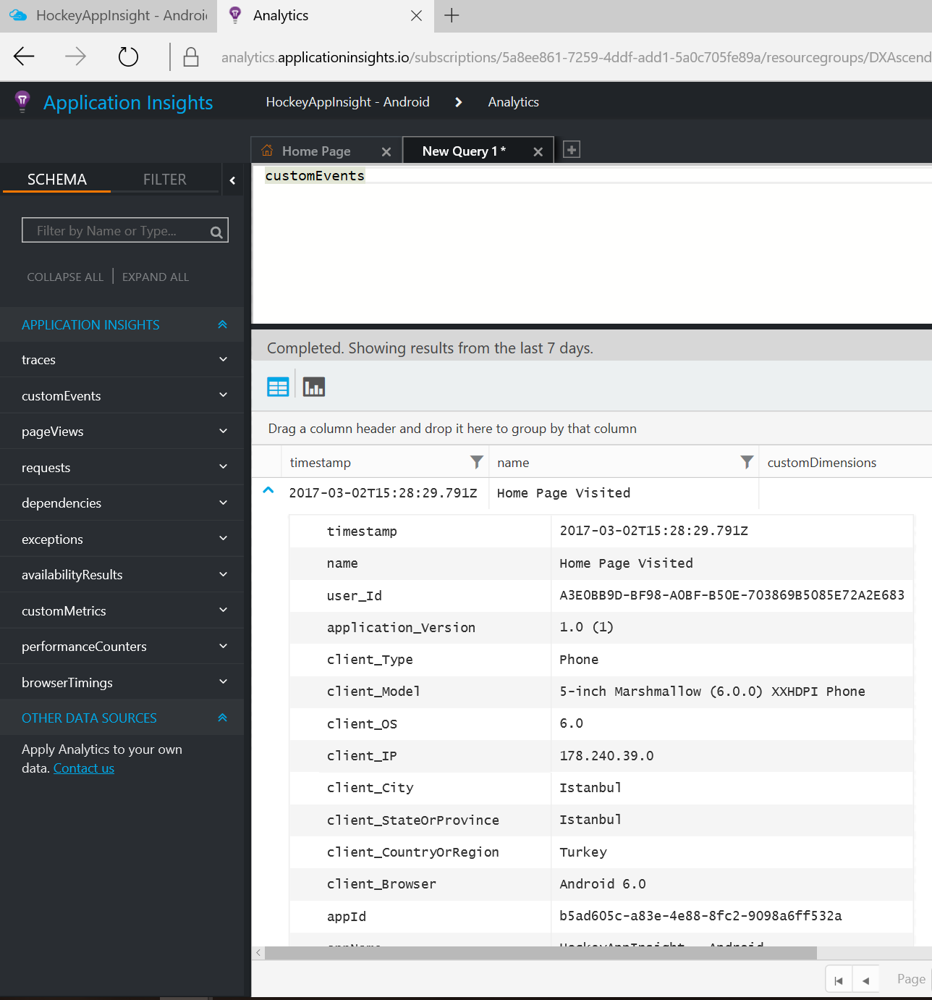
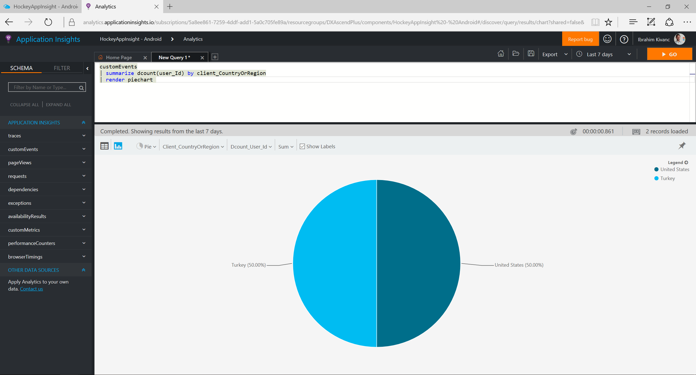
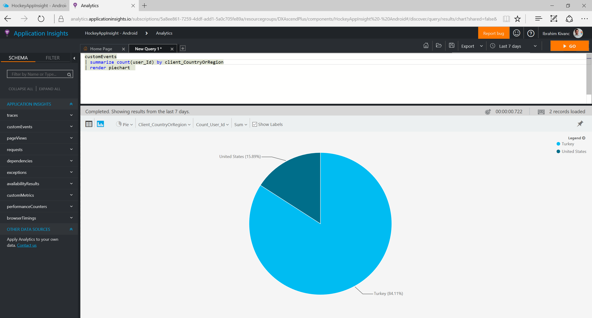

# Application Insight Analytics
Projeniz için Application Insight'I oluşturdukdan sonra uygulamanızın perfomasını ve kullanım bilgilerini görüntüleyebilmeniz için Application Insight Portal'i kullanabilirsiniz. Bu sayede uygulamanız tarafından Application Insight'a kaydedilen tüm telemetri bilgilerine ulaşarak Real-Time olarak sorgular atabilir ve sonrasında da bunları hem tablo içerisinde hem de grafikler içerisinde görselleştirebilirsiniz.

Application Insight'ın yapısı ve özelliklerini aşağıdaki grafikten daha iyi görebiliriz.
  

## Application Insight Anaytics'i kullanmak
1.  Application Insight'a projenizde Overview'a giderek
    
1. Ya da herhangi bir rapor kırılımına gittiğinizde "Analytics" e tıklayarak da detayları görebiliriz
    
1. Application Insight Analytics tarafında tüm detaylı bilgileri bulmak ve oluşturmak istediğiniz raporların detaylarını inceleyebilmek için https://docs.microsoft.com/en-us/azure/application-insights/app-insights-analytics-tour adresine gidebilirsiniz.

1. Application Insight Analytics Portal'e eriştikten sonra aşağıdaki şekilde Query'inizi yazabileceğiniz ve sonuçları hem tablo hem de chartlarda görebileceğiniz raporlama bölümünü görebileceksiniz.
    
1. Mobil uygulama ile testlerinizi gerçekleştirirken "CustomEvents" yazarak istediğiniz herhangi bir raporu tüm detayları ile görebilirsiniz.
    
1. Buradaki oluşturacağınız kendi sorgularınız ile de aşağıdaki şekilde raporlarınızı grafikler üzerinde de görebilirsiniz.
    
1. Ayrıca bu raporların nasıl değiştiğini de aşağıdaki gibi görebilirsiniz.
    

## Ek Kaynaklar
- [Application Insight Queries](https://docs.microsoft.com/en-us/azure/application-insights/app-insights-analytics-reference)

- [Application Insight Tour](https://docs.microsoft.com/en-us/azure/application-insights/app-insights-analytics-tour)