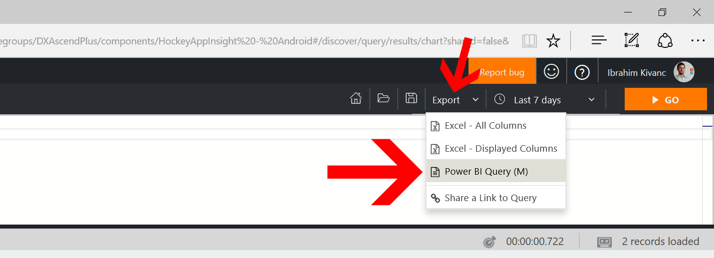
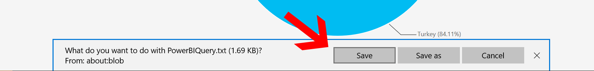
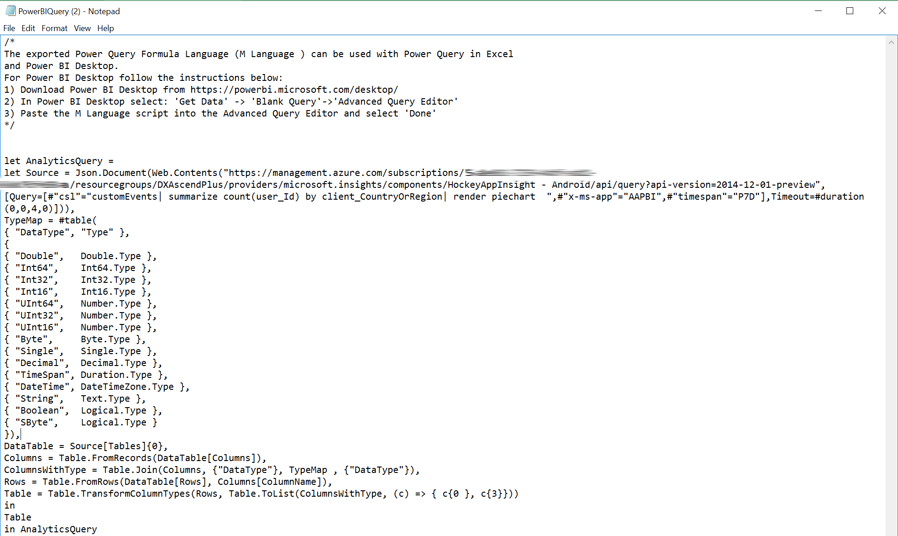
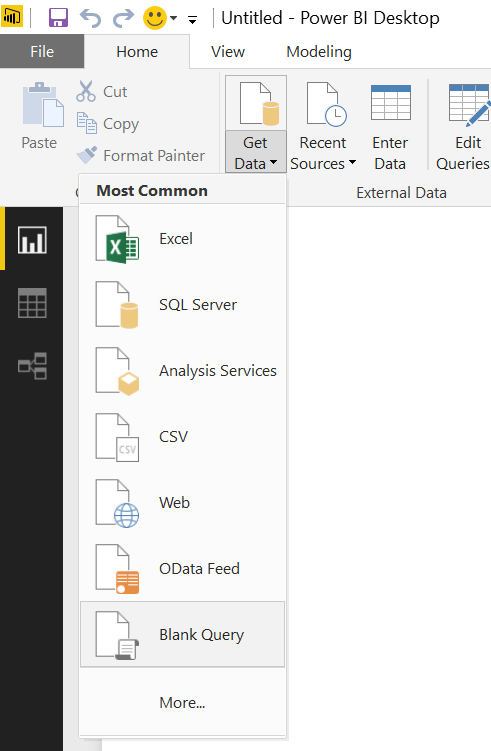
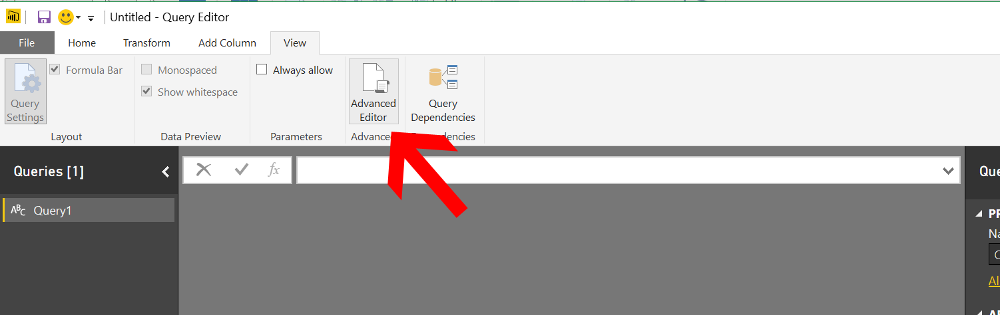
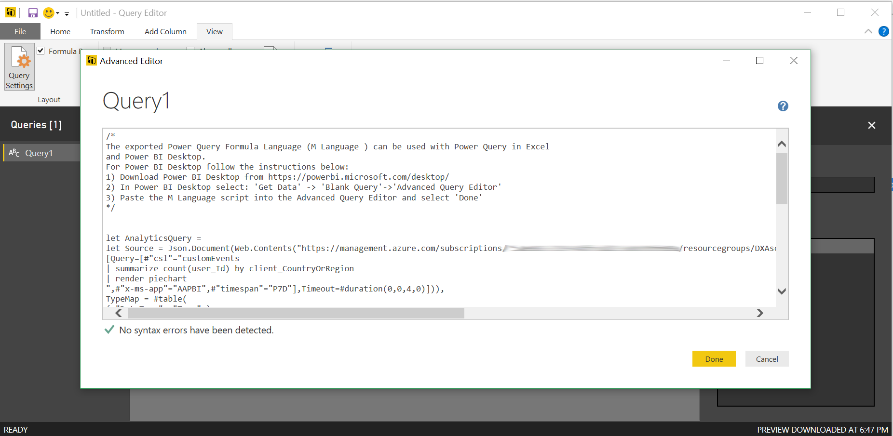
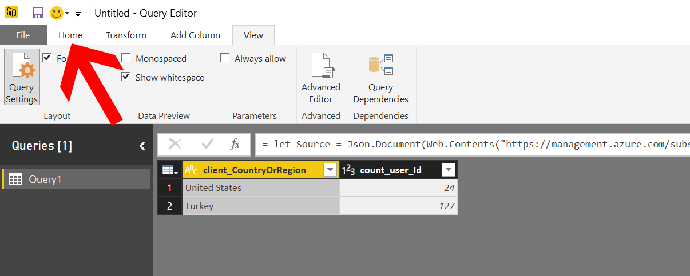
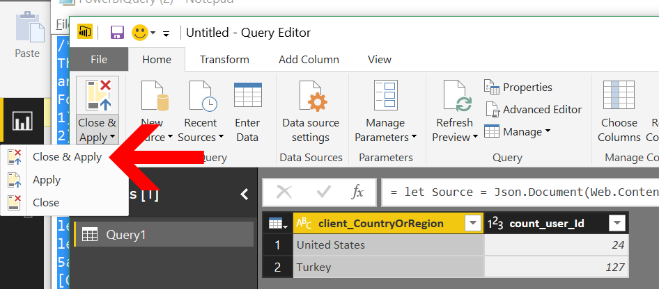
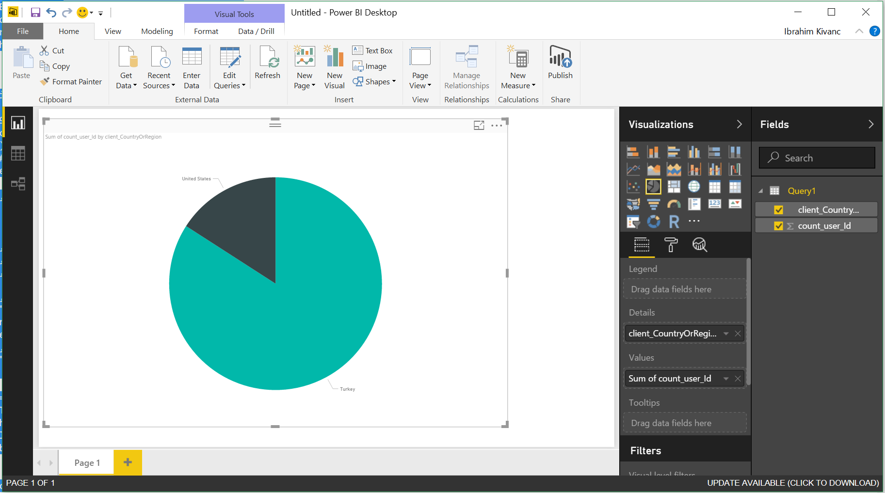

# Application Insight ve Power BI
Application Insight'taki telemetrilerin dinamik olarak sorgulanması ve sürekli elinizin altında anlık bilgiler alabileceğiniz hale dönüştürmek için Microsoft'un BI aracı olan PowerBI kullanabilirsiniz.

Bu bölümde Application Insight'taki tüm telemetri bilgilerinin nasıl kolay bir şekilde PowerBI içerisinde görselleştirilebileceğini göreceğiz.

## Application Insight verilerini PowerBI ile görselleştirmek

1. Application Insight Portal'e giderek istediğiniz sorguyu yazarak anlık olarak sonuçları elde edin. Daha sonra Export bölümünden "Power BI Query (M)" seçin
    
1. Bu sorgunun görselleştirmek için sorguyu bilgisayarınıza kaydedin.
    
1. Daha sonra bunu istediğiniz text editöründe açarak içerisindeki sorguyu kopyalayın.
    
1. Bu sorguyu kopyaladıktan sonra PowerBI Masaüstü uygulamanızı açın ve "GetData" bölümünden "Blank Query" bölümünü seçin.

    
1. Buradan açılan pencere içerisinde "View" sekmesine gelerek "Advanced Editör" seçin
    
1. Açılan ekrana kopyaladığını sorguyu yazarak tamam'a tıklayın.
    
1. Bu aşamada ilk defa bağlantı kuruyorsanız, bilgisayarınızda Azure hesabınıza ait
credential'lar aracılığı ile log-in ekranında login olmanız gerekecek.

1. Login işlemi tamamlandıktan sonra buradaki verilerin başarı ile çekildiğini görebileceksiniz.Bu adımda "Home" sekmesine tıklayın.
    

1. Veri talosunu gördükten sonra Home Sekmesinden "Close & Apply" seçeneğini seçebilirsiniz.
    

1. Veri aynağınız da PowerBI Projenize tamamlandıktan sonra buradaki verileri kullanarak istediğiniz grafiği PowerBI editörü üzerinde oluşturun. Ve verilerin dinamik olarak bir biri ile otomatik olarak ilişkilendirildiğini görebilirsiniz.
    

## Ek Kaynaklar
- [Feed Power BI from Application Insights](https://docs.microsoft.com/en-us/azure/application-insights/app-insights-export-power-bi)
- [Interactive Analytics with Application Insights](https://channel9.msdn.com/events/Build/2016/T666)
- [Exploring HockeyApp data in Application Insights](https://docs.microsoft.com/en-us/azure/application-insights/app-insights-hockeyapp-bridge-app)
- [Update: Mobile and Desktop app telemetry experience in Application Insights and HockeyApp](https://azure.microsoft.com/en-us/blog/mobile-and-desktop-telemetry-in-application-insight-and-hockeyapp/)
- [How to use HockeyApp with Visual Studio Team Services (VSTS) or Team Foundation Server (TFS)](https://support.hockeyapp.net/kb/third-party-bug-trackers-services-and-webhooks/how-to-use-hockeyapp-with-visual-studio-team-services-vsts-or-team-foundation-server-tfs)