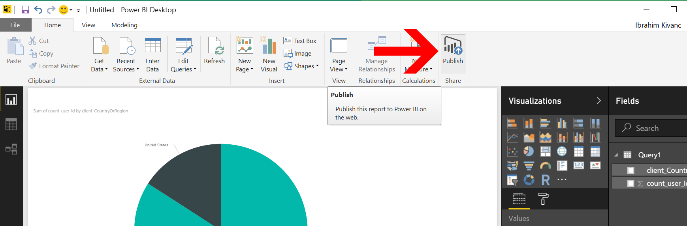
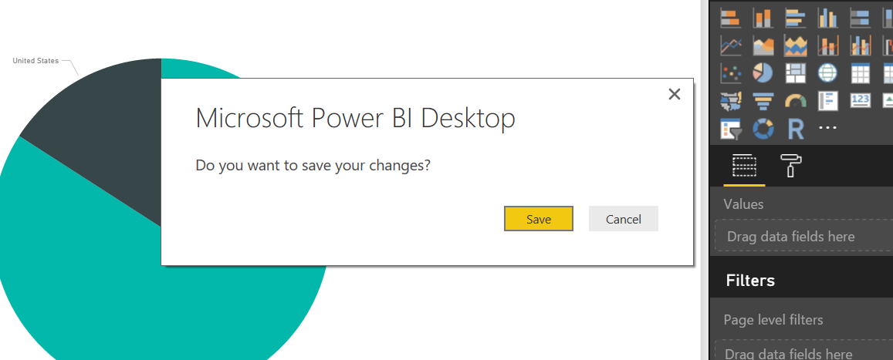
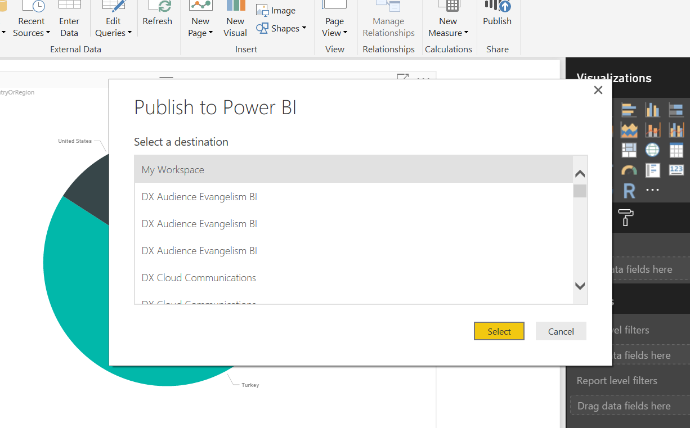
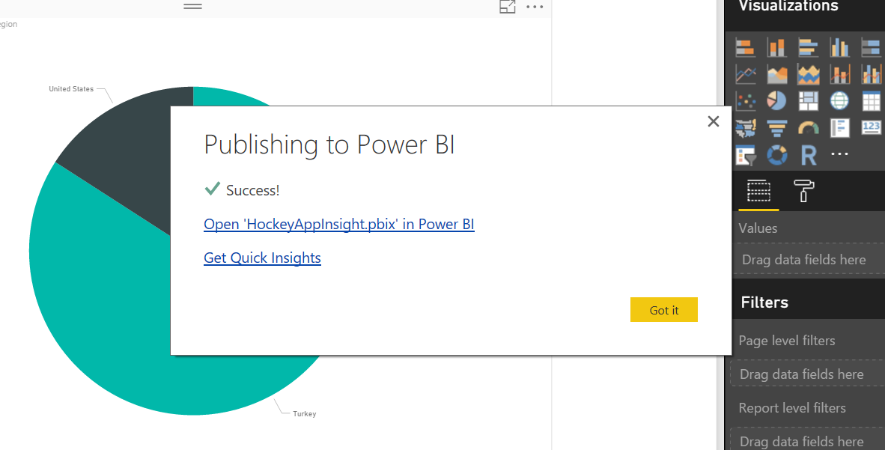
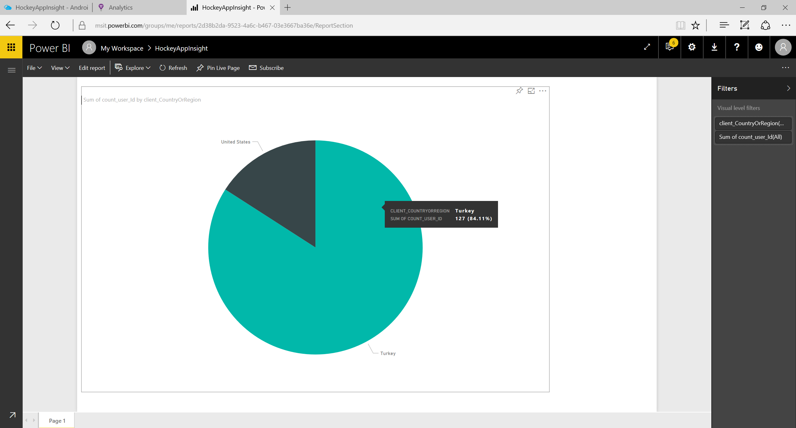

# Power BI Publish
PowerBI Masaüstü uygulamasında projelerinizi oluşturduktan sonra buradaki raporunuz daha fazla kişi tarafından erişilebilmesi için bu raporları yayınlamanızın bir kaç yöntemi var. Bunlardan birisi Office365 veya Sharepoint'iniz içerisinde kullanım lisansınızızın olması durumunda, kurum içerisine yayınlayabileceğini PowerBI Portalı. 

Bu rapor'u bu portal'e yayınlayabilmek için aşağıdaki adımları takip edebilirsiniz.

## PowerBI Raporu Yayınlama
1. Home sekmesinden sadece Publish'e tıklamanız yeterli olacaktır.
    

1. Eğer projeniz bu projede olduğu gibi kayıtlı değilse, bilgisayarınızdaki istediğiniz bir klasörünüze "HockeyAppInsight.pbix" olarak kaydetmeniz gerekecek.
    
1. Daha sonra PowerBI Portalinizde yayınlamak istediğiniz alanınızı belirleyip, buraya publish edebilirsiniz.
    
1. Projeniz başarı ile portalinize kaydolmuştur.
    

1. Daha sonra "Open 'HockeyAppInsight.pbix' in PowerBI" linkine tıklayarak web sayfasını görüntüleyin.

## Ek Kaynaklar
- [PowerBI Anasayfası](http://powerbi.microsoft.com/)
- [Feed Power BI from Application Insights](https://docs.microsoft.com/en-us/azure/application-insights/app-insights-export-power-bi)
- [Interactive Analytics with Application Insights](https://channel9.msdn.com/events/Build/2016/T666)
- [Exploring HockeyApp data in Application Insights](https://docs.microsoft.com/en-us/azure/application-insights/app-insights-hockeyapp-bridge-app)
- [Update: Mobile and Desktop app telemetry experience in Application Insights and HockeyApp](https://azure.microsoft.com/en-us/blog/mobile-and-desktop-telemetry-in-application-insight-and-hockeyapp/)
- [How to use HockeyApp with Visual Studio Team Services (VSTS) or Team Foundation Server (TFS)](https://support.hockeyapp.net/kb/third-party-bug-trackers-services-and-webhooks/how-to-use-hockeyapp-with-visual-studio-team-services-vsts-or-team-foundation-server-tfs)