# Power BI Embedded
PowerBI ile görselleştirmenin bir diğer yöntemi de Azure hesabınız üzerinden kullanabileceğiniz PowerBI Embedded versiyonu. Burada tek yapmanız gereken, masaüstünde oluşturduğunuz PowerBI projenizi Azure Hesabınızdaki PowerBI Embedded üzerindeki çalışma alanınıza yayınlamak.

## Gereksinimler
- [Sample workspace web app](http://go.microsoft.com/fwlink/?LinkId=761493)
- [Power BI Embedded API reference](https://msdn.microsoft.com/en-US/library/azure/mt711507.aspx)
- [Power BI Embedded .NET SDK (available via NuGet)](http://go.microsoft.com/fwlink/?LinkId=746472)
- [JavaScript Report Embed Sample](https://microsoft.github.io/PowerBI-JavaScript/demo)

## PowerBI Raporu'unu Web Uygulamasına Embed Etme 
Bir önceki adımda oluşturduğumuz PowerBI linkini yayınlamak için aşağıdaki adımları gerçekleştirelim. Bu projemizi hazır bir örnek workspace uygulaması içerisie gömeceğiz.

1. HockeyAppInsight'ı daha sonra erişmek üzere istediğiniz bir dizine kaydedin. Ben bu örnekte "C:\D\PowerBI\HockeyAppInsight.pbix" olarak ilgili dizine kaydedeceğim.
    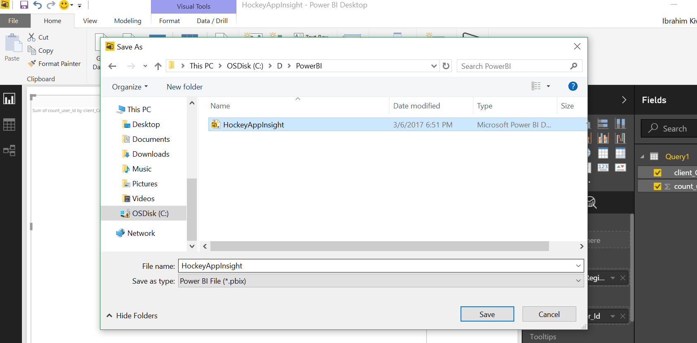	

1. Azure Portal'a giderek, "Intelligence + anaytics"in altından "Power BI Embedded" ı seçerek Workspace Collection Name'i vererek yeni bir PowerBI Embedded projesi oluşturalım.
	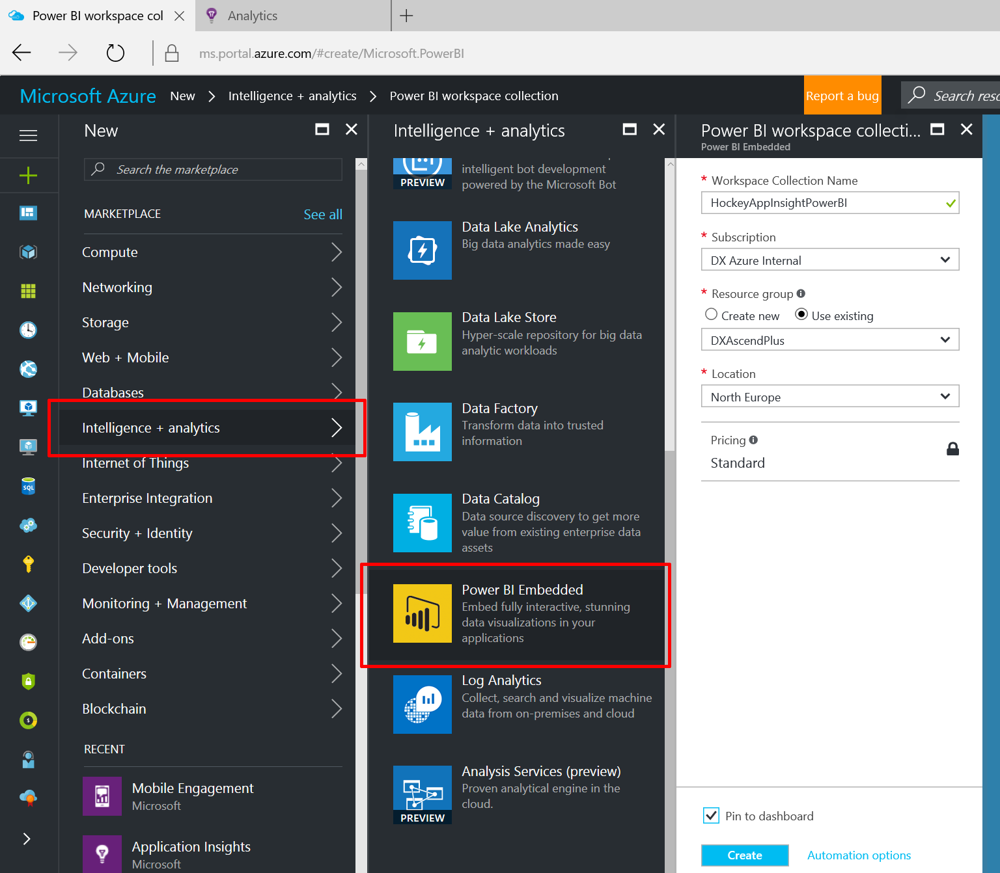	

1. [Sample workspace web app](http://go.microsoft.com/fwlink/?LinkId=761493) adresindeki uygulamayı indirerek solution'a sağ tıklayarak ilgili nuget paketlerini restore ederek projeyi derleyelim. Başarı ile derlendiğini gördükten sonra "ProvisionSample" projesini başlangıç projesi olarak seçip çalıştıralım.
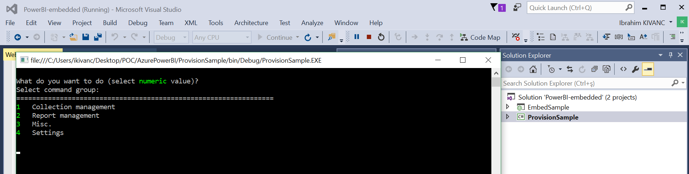	

 1. Karşımıza çıkan konsol ekranı aracılığı ile Azure üzerine oluşturduğumu Power BI Embedded projesini buradan yöneteceğiz. Bunun için ilk adım olarak 1 yazarak "Collection Management"ı seçelim. Ve 4 komutu ile "Provision a new Workspace Collection" ı seçelim.
	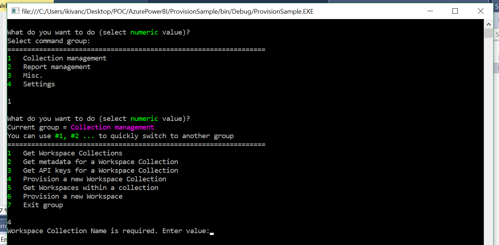	
	
1. Daha Sonra buradan "WorkSpace Collection Name"I azure üzerindeki projemizde, Resource Group ve Subscription ID bilgilerini alarak console uygulamamıza girelim.
		
	
1. Daha sonra PowerBI Embedded projesinden ilgili Access Key'ini alalım.
	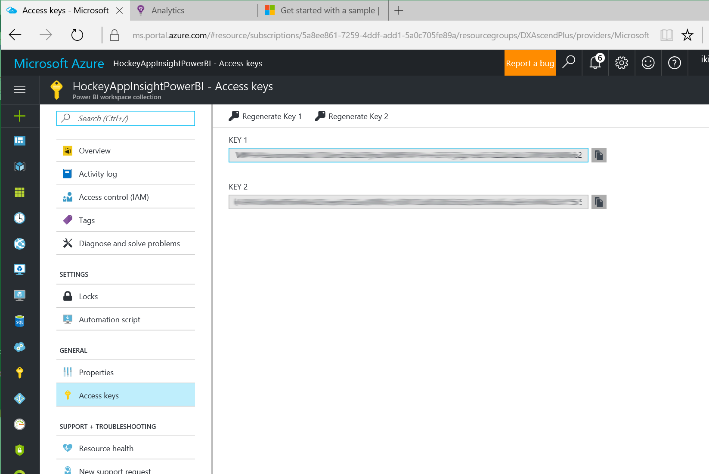	
	

1. Tüm bu bilgileri girdikten sonra aşağıdaki gibi console üzerinde workspace'imizin ID'sini görerek başarı ile oluşturulduğunu görebiliriz.
	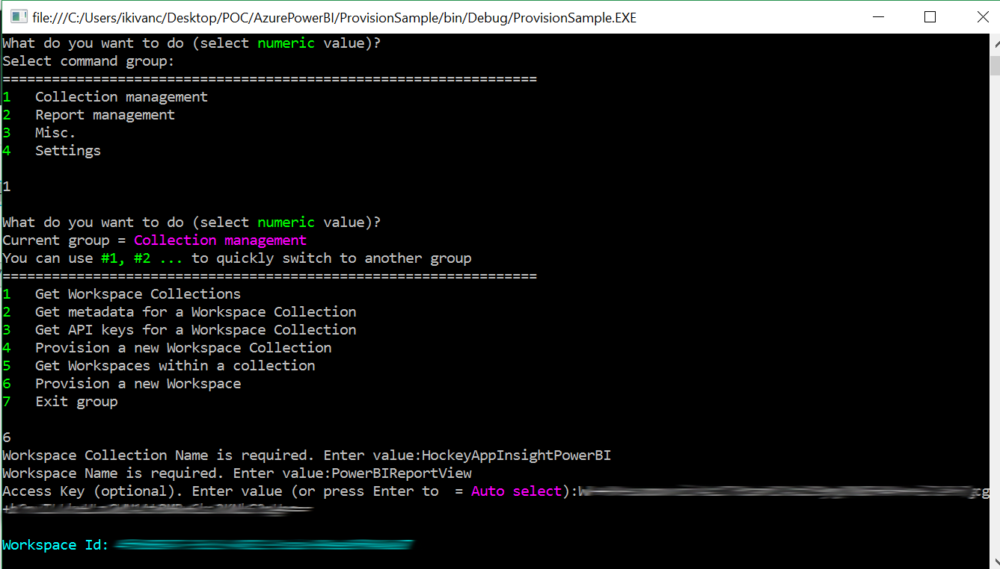	

1. Azure Portal üzerinde de PowerBI Embedded projemizin WorkSpaces bölümünde oluşturduğumuz workspace'I ve ID'sini görebiliriz.
	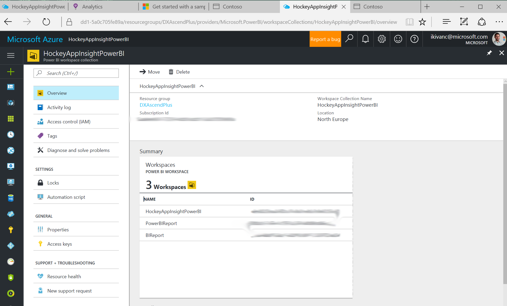	

1. Bir sonraki aşama olarak buradaki workspace'imizin içerisinde bilgisayarımıza kaydettiğimiz powerBI PBIX dosyasını yükleyeceğiz. Bunun için "Collectionlar" seçeceğinden çıkmak için 7 yazıp gruptan çıkıyoruz. Daha sonras 2 yi seçerek Report Management'I seçiyoruz. 
	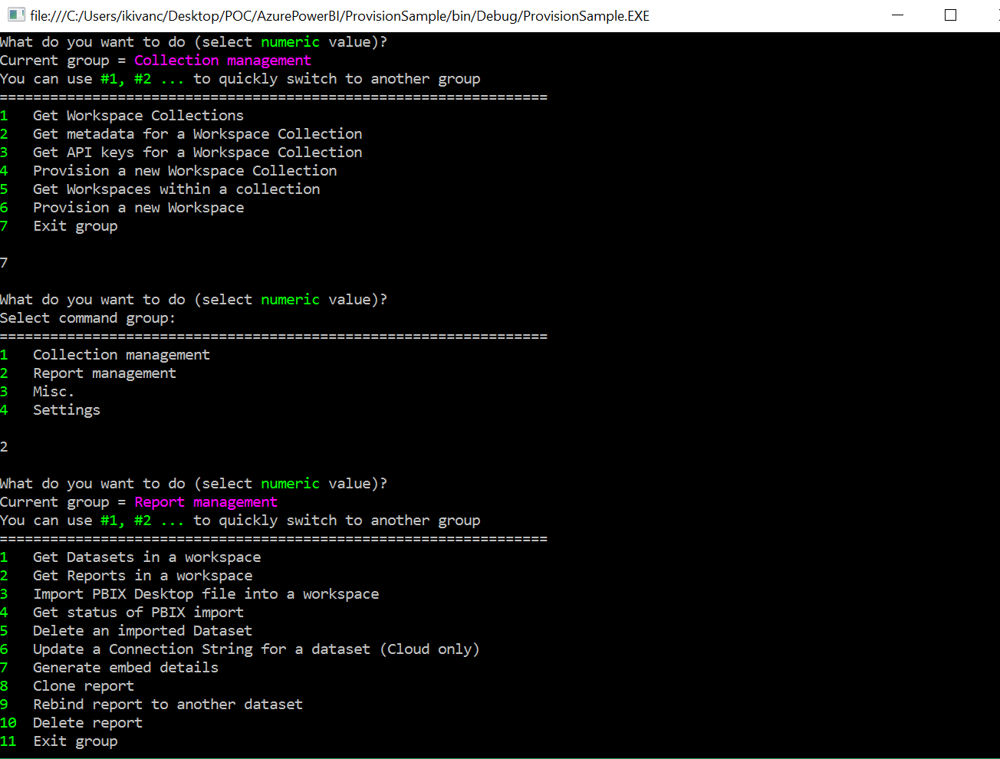	

1. Arından seçeneceklerden 3'ü seçerek "Import PBIX Desktop file into a workspace" seçeneğini seçerek pbix dosyamızı yüklemek için ilk adımı atıyoruz. Daha sonrasa karşımıza çıkan ekranda "Workspace Collection Name", oluşturduğumuz "Workspace ID", Workspace olarak görüntülenmek üzere bir dataset adı veriyoruz ve arıdından dosyamızın bulunduğu dizini console ekranınıa yazıyoruz.
	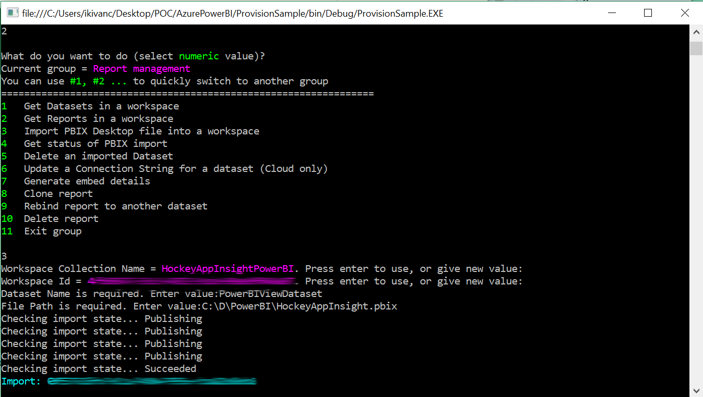	

1. Başarı ile yüklendi mesajını gördükten sonra raporumuz görüntülemeye hazır.

1. Github üzerinden indirmiş olduğumuz projemizi yeniden açıp web uygulaması tarafında "WebConfig" içerisinde aşağıdaki değişiklikleri gerçekleştiriyoruz. AccessKey, WorkSpaceCollection, WorkspaceID bilgilerini kullanarak projemizi güncelliyoruz. Güncellemeden sonra webconfig'in ilgili kısmı aşağıdaki halini alıyor.
    ```xml
    <appSettings file="Cloud.config">
        <add key="powerbi:AccessKey" value="BURAYA POWERBI EMBEDDED ACCESS KEY GELECEK"/>
        <add key="powerbi:WorkspaceCollection" value="HockeyAppInsightPowerBI"/>
        <add key="powerbi:WorkspaceId" value="BURAYA OLUŞTURDUĞUNUZ POWERBI EMBEDDED KEY GELECEK"/>
        <add key="powerbi:ApiUrl" value="https://api.powerbi.com"/>
    </appSettings>
    ```
1. Şimdi Visual Studio içerisinde Web Projesini başlangıç projesi olarak işaretleyip çalıştırdıktan sonra aşağıdaki şekilde demo web projesinin portal arayüzü gelecek. Buradan Report'a tıklayarak kayıtlı olan raporuza erişebiliriz.
	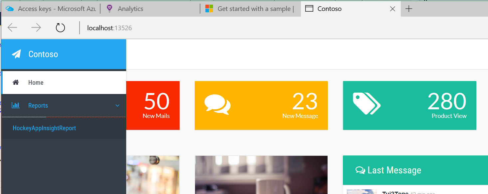

1. İlgili linke tıkladıktan sonra aşağıdaki şekilde PowerBI raporumuzu web projesi içerisinde görebileceğiz. Sağ taraftaki ayarları sayesinde de Raporunuzun görünümü üzerinde değişiklikler yapabilirsiniz.
	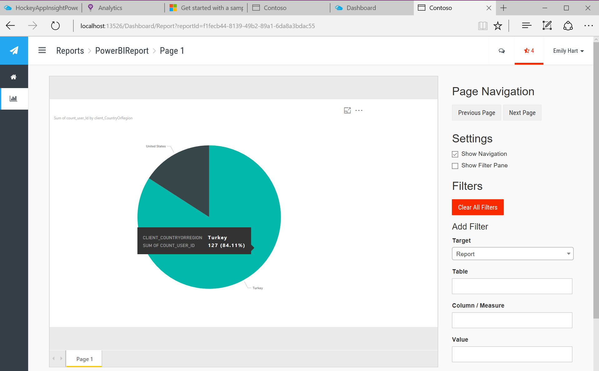


## Ek Kaynaklar
- [PowerBI Anasayfası](http://powerbi.microsoft.com/)
- [Feed Power BI from Application Insights](https://docs.microsoft.com/en-us/azure/application-insights/app-insights-export-power-bi)
- [Interactive Analytics with Application Insights](https://channel9.msdn.com/events/Build/2016/T666)
- [Exploring HockeyApp data in Application Insights](https://docs.microsoft.com/en-us/azure/application-insights/app-insights-hockeyapp-bridge-app)
- [Update: Mobile and Desktop app telemetry experience in Application Insights and HockeyApp](https://azure.microsoft.com/en-us/blog/mobile-and-desktop-telemetry-in-application-insight-and-hockeyapp/)
- [How to use HockeyApp with Visual Studio Team Services (VSTS) or Team Foundation Server (TFS)](https://support.hockeyapp.net/kb/third-party-bug-trackers-services-and-webhooks/how-to-use-hockeyapp-with-visual-studio-team-services-vsts-or-team-foundation-server-tfs)